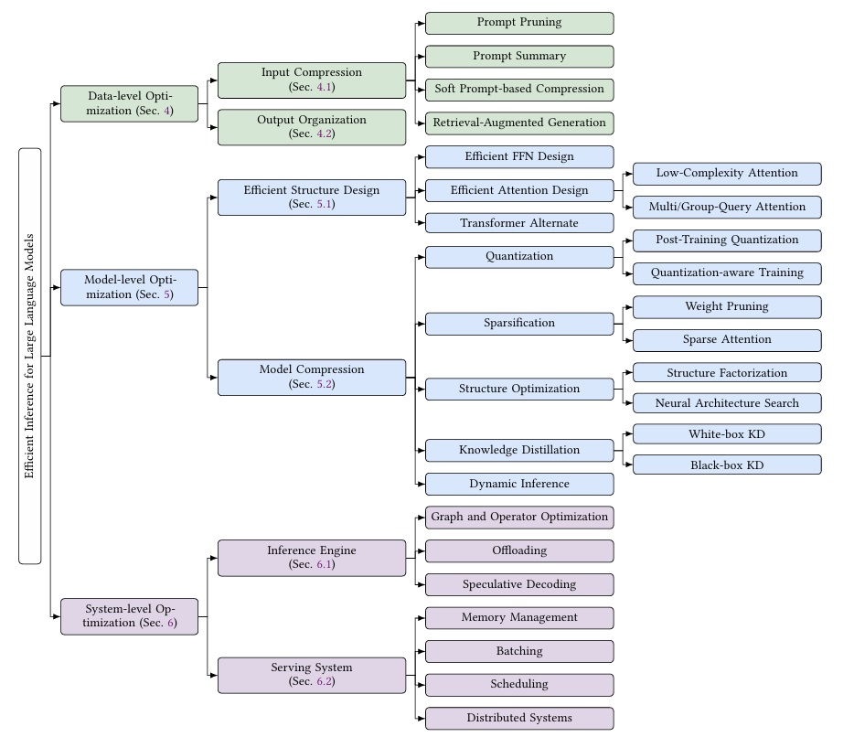

# 🚀 Awesome-Efficient-LLM-Inference


<div style="text-align: center;">
  
  <div style="font-size: 10px;">Taxonomy of efficient inference methods for Large Language Models.</div>
</div>


## 🌟 About This Hub

  
# 📚 Contents


   
#  📖 Cite Our Work
If our work is helpful to your research, we'd be glad if you could cite our paper [here](https://arxiv.org/abs/2404.14294):

```bibtex
@article{zhou2024survey,
  title={A survey on efficient inference for large language models},
  author={Zhou, Zixuan and Ning, Xuefei and Hong, Ke and Fu, Tianyu and Xu, Jiaming and Li, Shiyao and Lou, Yuming and Wang, Luning and Yuan, Zhihang and Li, Xiuhong and others},
  journal={arXiv preprint arXiv:2404.14294},
  year={2024}
}
```

# 📄 License

This project is open-source and available under the MIT License. See the [LICENSE](LICENSE) file for more details.
